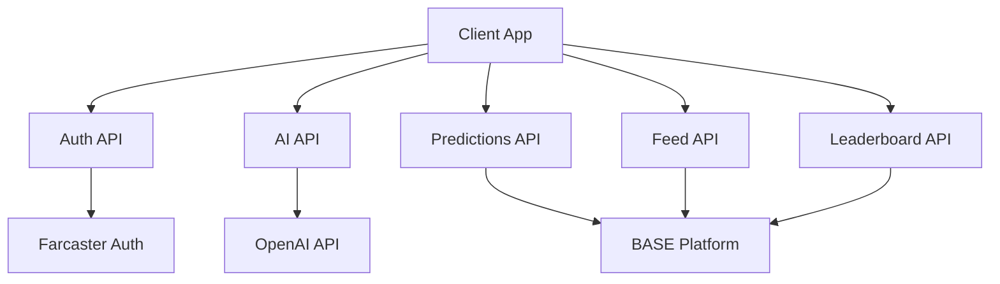

# Architecture

This document outlines the high-level architecture of Predictly, including key components, data flow, and design decisions.

## System Overview



## Key Components

### Frontend (Next.js App Router)

- `/app/page.tsx` - Landing page
- `/app/predict/page.tsx` - Prediction creation
- `/app/feed/page.tsx` - Activity feed
- `/app/leaderboard/page.tsx` - Global rankings
- `/app/profile/[userId]/page.tsx` - User profiles
- `/app/dashboard/page.tsx` - Personal dashboard

Components are organized by feature:
- `app/components/FeedItem.tsx` - Feed entry display
- `app/components/PredictionCard.tsx` - Prediction display
- `app/components/LeaderboardRow.tsx` - Leaderboard entry
- `app/components/Sidebar.tsx` - Navigation

### Backend (API Routes)

API routes handle specific domains:
- `/api/auth/` - Farcaster JWT verification
- `/api/ai/` - OpenAI integration for analysis
- `/api/predictions/` - CRUD for predictions
- `/api/feed/` - Activity feed aggregation
- `/api/leaderboard/` - Rankings calculation
- `/api/users/` - User profiles and stats

### Data Layer

Production mode uses BASE as the primary data store:
- Predictions
- User profiles
- Leaderboard stats
- Activity feed

Demo mode uses in-memory storage with the same interfaces.

### External Services

- **Farcaster**: User authentication via JWT
- **OpenAI**: AI-powered prediction analysis
- **BASE**: Data persistence and business logic
- **Vercel**: Deployment and hosting

## Data Flow

### Authentication Flow

1. User connects Farcaster wallet
2. Client receives JWT
3. JWT verified by `/api/auth`
4. User ID (fid) extracted and used for subsequent requests

### Prediction Creation

1. User submits prediction in UI
2. Client calls AI endpoint for analysis
3. Prediction saved to BASE (or memory in demo)
4. Feed and leaderboard updated
5. Realtime updates pushed to UI

### Feed Generation

1. Client requests feed page
2. Server queries recent predictions
3. Augmented with user details
4. Sorted by recency
5. Paginated response returned

### Leaderboard Calculation

1. Periodic job aggregates user stats
2. Calculates accuracy and streaks
3. Updates leaderboard rankings
4. Cached for quick reads

## Security Considerations

### Authentication
- All API routes require valid Farcaster JWT
- JWTs verified on every request
- No sensitive data in JWT claims

### Authorization
- Users can only modify their own predictions
- Admin routes protected by role checks
- Rate limiting on all endpoints

### Data Protection
- No sensitive user data stored
- All external API keys in environment
- CORS configured for production domain

## Development Setup

### Local Development
```bash
# Start Next.js dev server
npm run dev

# Run with demo mode (no external deps)
NEXT_PUBLIC_USE_STATIC_DEMO=true npm run dev

# Run with BASE integration
BASE_API_KEY=xxx npm run dev
```

### Testing
```bash
# Run unit tests
npm test

# Run integration tests
npm run test:integration

# Run e2e tests
npm run test:e2e
```

## Deployment

### Production Requirements
- Node.js 18+
- Vercel account
- BASE project and API keys
- OpenAI API key
- Farcaster app registration

### Environment Variables
```bash
# Required
NEXT_PUBLIC_URL=https://your-app.vercel.app
BASE_API_KEY=xxx
BASE_PROJECT_ID=xxx
OPENAI_API_KEY=xxx

# Optional
NEXT_PUBLIC_USE_STATIC_DEMO=false
```

### Deployment Commands
```bash
# Deploy to Vercel
vercel

# Deploy to production
vercel --prod
```

## Future Improvements

1. **Real-time Updates**
   - Add WebSocket support
   - Live prediction updates
   - Instant leaderboard changes

2. **Scalability**
   - Add Redis caching
   - Implement job queue
   - Shard data by user segment

3. **Features**
   - Social sharing
   - Prediction categories
   - Achievement system
   - Mobile app

4. **Performance**
   - Add edge caching
   - Optimize bundle size
   - Implement progressive loading