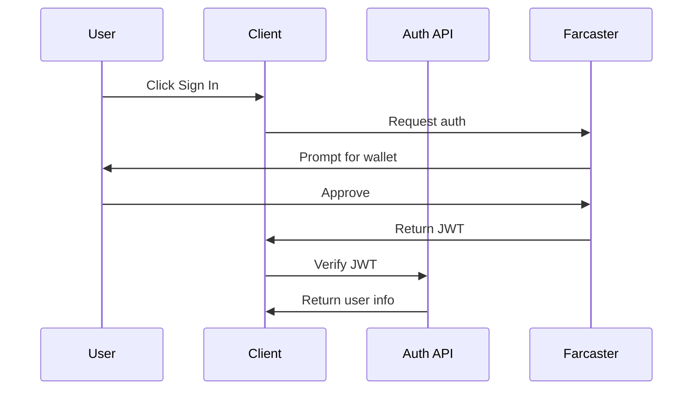

# Authentication

This document details the authentication flow in Predictly, which uses Base Account for user authentication.

## Overview

Predictly uses Base Account for authentication, allowing users to sign in with their Base Account. The authentication flow is handled by the Base Account SDK and OnchainKit, providing a secure and seamless authentication experience.

## Authentication Flow



## Implementation Details

### Client-side Setup

Base Account is integrated using the official Base Account CDN script. Add the script to your layout:

```typescript
// app/layout.tsx
export default function RootLayout({
  children,
}: {
  children: React.ReactNode;
}) {
  return (
    <html lang="en">
      <head>
        <script src="https://cdn.base.org/base-account/latest.js"></script>
      </head>
      <body>
        {children}
      </body>
    </html>
  );
}
```

The Base Account SDK is available globally through `window.BaseAccount` and provides the following methods:
- `connect()`: Opens the Base Account modal for connection
- `disconnect()`: Disconnects the current account
- `getAccounts()`: Returns array of connected accounts
- `isConnected()`: Checks current connection status

### Server-side Verification

```typescript
// app/api/auth/route.ts
import { createClient } from "@farcaster/quick-auth";

const client = createClient();

export async function GET(request: NextRequest) {
  const authorization = request.headers.get("Authorization");
  if (!authorization?.startsWith("Bearer ")) {
    return NextResponse.json(
      { message: "Missing token" },
      { status: 401 }
    );
  }

  try {
    const payload = await client.verifyJwt({
      token: authorization.split(" ")[1],
      domain: getUrlHost(request)
    });

    return NextResponse.json({
      success: true,
      user: {
        fid: payload.sub,
        issuedAt: payload.iat,
        expiresAt: payload.exp
      }
    });
  } catch (e) {
    // Handle errors...
  }
}
```

## Using Authentication

### Protected API Routes

```typescript
// Example of a protected route
export async function GET(request: NextRequest) {
  // Get authorization header
  const authorization = request.headers.get("Authorization");
  if (!authorization?.startsWith("Bearer ")) {
    return NextResponse.json(
      { message: "Unauthorized" },
      { status: 401 }
    );
  }

  // Verify JWT
  try {
    const payload = await verifyAuth(authorization);
    const userId = payload.sub;
    
    // Handle authenticated request...
  } catch (error) {
    return NextResponse.json(
      { message: "Invalid token" },
      { status: 401 }
    );
  }
}
```

### Client-side Auth Hooks

```typescript
// Using auth in components
import { useAuth } from "../hooks/useAuth";

export function ProtectedComponent() {
  const { isAuthenticated, login } = useAuth();

  if (!isAuthenticated) {
    return (
      <button onClick={login}>
        Sign in with Farcaster
      </button>
    );
  }

  return <div>Protected content</div>;
}
```

## Environment Variables

No environment variables are required for Base Account integration as we're using the CDN approach. The Base Account SDK is loaded directly from the CDN and handles authentication internally.

## Security Considerations

1. **JWT Verification**
   - All JWTs are verified server-side
   - Domain is validated against request origin
   - Expiry times are enforced

2. **CORS**
   - Configured for your deployment domain
   - Prevents unauthorized cross-origin requests

3. **Rate Limiting**
   - Auth endpoints are rate-limited
   - Prevents brute force attempts

4. **Token Storage**
   - JWTs stored in memory (not localStorage)
   - Cleared on page refresh/tab close

## Error Handling

Common authentication errors and their meanings:

```typescript
enum AuthError {
  MISSING_TOKEN = "Missing authentication token",
  INVALID_TOKEN = "Invalid or expired token",
  DOMAIN_MISMATCH = "Token domain mismatch",
  NETWORK_ERROR = "Network error during verification"
}
```

## Development and Testing

### Local Testing

```bash
# Start dev server
npm run dev

# Test authentication flow
curl -H "Authorization: Bearer <token>" \
     http://localhost:3000/api/auth
```

### Mock Authentication (Demo Mode)

When `NEXT_PUBLIC_USE_STATIC_DEMO=true`:
- Authentication is simulated
- JWT verification is bypassed
- Fixed test user is provided

## Deployment Checklist

- [ ] Set `NEXT_PUBLIC_URL` to production URL
- [ ] Configure CORS for production domain
- [ ] Set up monitoring for auth failures
- [ ] Configure rate limiting
- [ ] Test auth flow in production

## Troubleshooting

Common issues and solutions:

1. **"Invalid token" errors**
   - Check token expiration
   - Verify domain configuration
   - Ensure clock sync between services

2. **CORS errors**
   - Add domain to allowed origins
   - Check request headers
   - Verify SSL configuration

3. **Rate limiting**
   - Implement token bucket algorithm
   - Add retry logic with backoff
   - Monitor rate limit headers

## Future Improvements

1. **Additional Auth Methods**
   - Add email/password option
   - Support other web3 wallets
   - OAuth provider integration

2. **Security Enhancements**
   - Add refresh tokens
   - Implement session management
   - Add device fingerprinting

3. **User Management**
   - Add role-based access control
   - Implement user preferences
   - Add account linking